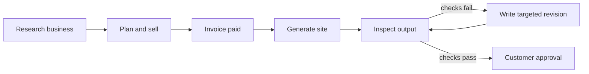

# Callan

Callan is an autonomous web agency. It finds a local business with weak online presence, researches the opportunity, conducts outreach, closes and invoices the work, builds the site, inspects the result, and corrects its own mistakes before delivery.

The hackathon claim is intentionally narrow and provable:

> One agent loop takes a paid website job from evidence to a QA-verified build, including a targeted self-correction when the first output fails.

## What the demo proves

The safe mock lifecycle exercises the same orchestration and persistence boundaries as the live system without placing calls, sending email, charging a card, or mutating an external builder.



The demo deliberately gives the first mock build a fixable contact/schema defect. Callan records the failed acceptance checks, creates a revision prompt limited to those failures, re-renders the candidate, re-runs QA, and persists final acceptance. The Loop screen reads that evidence from SQLite; it does not animate a hard-coded success story.

## Quick start

Requirements:

- Node `22.22.0` (`.nvmrc` is included)
- npm `10.9.x`
- Chromium for browser verification

```sh
nvm use
npm ci
npm run demo:e2e -- --data-dir .data/demo --reset-demo-data
DATA_DIR=.data/demo npm run dev
```

Open the Vite URL and stay on the default **Loop** screen. It automatically selects the latest run and shows:

- the spec → plan → act → observe → repair → verify cycle;
- the first failed QA result and exact acceptance errors;
- the targeted revision count;
- the final QA score and release state;
- a link to the locally generated preview;
- the underlying decision ledger.

The lightweight agent floor, queues, portfolio controls, memory, scraper, and settings remain available under **Operations**, **Portfolio**, and **Tools**. They are secondary operator surfaces, not the opening explanation.

## Demo commands

| Command | Purpose |
| --- | --- |
| `npm run demo:e2e` | Run the complete safe lifecycle and verify its API/UI contract. |
| `npm run demo:e2e -- --no-build` | Reuse the current frontend build while exercising the lifecycle. |
| `npm run demo:e2e -- --no-verify-ui` | Skip the temporary HTTP/browser-facing smoke. |
| `npm run check` | Syntax-check server and script files. |
| `npm run check:builder-hooks` | Prove brief validation, generated-site QA, revisions, and launch gating. |
| `npm run check:release` | Prove the final URL, security, source, ownership, and domain release gates. |
| `npm run check:safety` | Verify live-side-effect safety policy. |
| `npm run check:production-safety` | Verify production mode refuses unsafe configuration. |
| `npm run check:ci` | Run the full deterministic suite. |
| `npm run check:deploy` | Add real-browser and production HTTP verification. |

Useful demo variants:

```sh
npm run demo:e2e -- --data-dir .data/demo --reset-demo-data
npm run demo:e2e -- --no-build
npm run demo:e2e -- --allow-live-env --verbose
```

`--allow-live-env` preserves configured credentials for verification reads. The seeded lifecycle itself remains mocked.

## Three-minute walkthrough

1. **State the product:** “Callan is an agency, not an agent dashboard. It sells and delivers websites.”
2. **Show the Loop screen:** point to the persisted run for the seeded business.
3. **Show failure:** the first generated output failed visible contact and structured-data checks.
4. **Show correction:** Callan wrote a narrow revision from those exact failures.
5. **Show verification:** the second inspection passed at 100 and moved to customer approval.
6. **Open the preview:** prove there is a customer-visible artifact.
7. **Open Operations briefly:** establish that calls, memory, browser work, handoffs, and safety gates are inspectable.

Do not spend the demo narrating every provider, route, table, or dashboard. The self-correcting delivery loop is the product proof.

## Architecture

The project is a React/Vite console backed by an Express service and SQLite event ledger.

```text
src/
  App.jsx                 shell, live event state, progressive navigation
  views/LoopView.jsx      judge-facing loop proof
  views/OperationsView.jsx advanced agent workbench
server/
  index.js                HTTP/SSE boundary and orchestration routes
  workers/                research, voice, analysis, mail, and build workers
  fulfillment/hooks/      brief, inspect, revision, and final-accept loop
  fulfillment/release.js  final publication, portability, ownership, and domain gate
  customerLinks.js        purpose-scoped customer capability URLs
  db.js                   durable operational ledger
scripts/
  demo-e2e.js             deterministic full-lifecycle harness
```

Key persisted evidence for the build loop:

- `build_hooks`: pre-brief, validation, submit, inspect, revision-plan, and final-accept hooks;
- `build_qa_results`: checklists, errors, claim analysis, scores, and inspected output;
- `build_revisions`: targeted prompts, attempts, and submission results;
- `events`: the live operator timeline;
- `builds`: preview, project, launch, and approval state.

## Safety boundary

Mock mode is the default demonstration posture. Live side effects are independently gated:

- `LIVE_CALLS`
- `LIVE_EMAILS`
- `LIVE_PAYMENTS`
- `LIVE_BUILDS`
- target allow-lists and consent/callability policy
- provider credentials
- production readiness checks

The UI labels mock mode as mock. Provider configuration is not presented as production readiness, and customer launch remains separate from internal QA acceptance.

Never use production payment credentials for the hackathon demo. Copy `.env.example` to a local `.env`; secrets and local databases are ignored by Git.

## Sponsor integration

Sponsor qualification is intentionally being reworked against the current event requirements. Existing provider adapters remain in the codebase, but this README does not claim a final sponsor stack until those integrations are re-verified together.

## Configuration

Start from the documented template:

```sh
cp .env.example .env
```

Important baseline values:

```dotenv
RUN_MODE=mock
LIVE_CALLS=false
LIVE_EMAILS=false
LIVE_PAYMENTS=false
LIVE_BUILDS=false
AUTONOMOUS_OUTREACH_ENABLED=false
```

`DEMO_FORCE_QA_REVISION=true` is set automatically by `demo:e2e` so the self-correction is visible. Leave it false for ordinary mock development when a clean first-pass build is preferred.

## Lovable delivery boundary

Callan uses Lovable's Build-with-URL flow through a dedicated Browser Use persistent profile and exact Lovable workspace. Automation creates a temporary review preview; it never treats that preview as the final customer deliverable. Final publication requires the Lovable security review, a verified public URL, customer-portable source, ownership evidence, and a domain decision.

Set `BROWSER_USE_PROFILE_ID`, `LOVABLE_WORKSPACE_NAME`, and `PREVIEW_FRAME_SOURCES=https://*.lovable.app` before a live navigation smoke. See [the production readiness audit](docs/production-readiness-audit.md) for the complete publish, GitHub, domain, transfer, and customer handoff runbook.

## Production deployment

The supported initial topology is one Node 22 container, one encrypted persistent SQLite volume, encrypted off-host backups, TLS, and an MFA-enforced identity-aware proxy. The container is read-only apart from `DATA_DIR`; horizontal replicas are intentionally blocked.

Start in `production_review` with every live side effect disabled. Configure providers and webhooks, run dry and owned-target live smokes, complete the staging/load certification and restore drill, then require both commands to exit zero:

```sh
npm run check:production -- --strict
npm run safe-to-sell
```

Security findings and operational constraints are documented in [security_best_practices_report.md](security_best_practices_report.md).

## Current scope

Callan is a production-minded release candidate with a working agency lifecycle and durable self-correcting fulfillment loop. This checkout is not production-live: the current environment lacks live credentials, webhook proof, provider certification, encrypted-storage/restore evidence, MFA enforcement, and legal sign-off. Keep it in mock/review mode until the strict production gates pass. Sponsor qualification remains intentionally deferred for separate review.
