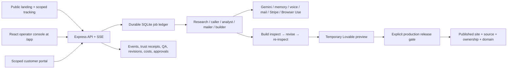
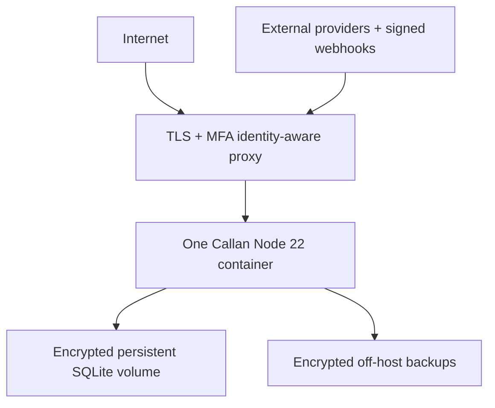

# Callan end-to-end product and production-readiness audit

Audit date: 2026-08-04
Decision: **code release candidate; production activation on hold pending external evidence**

## 1. Product overview

Callan is an autonomous website agency for local service businesses. It is not merely a chatbot or an agent-monitoring dashboard. Its job is to move a real customer engagement through a controlled commercial and fulfillment lifecycle:

1. find a local business with weak or missing owned web presence;
2. research public evidence and build an attributable business profile;
3. choose a pitch and conduct compliant voice/email outreach;
4. capture interest, confirm the customer's email, and invoice the job;
5. turn paid work into a structured website brief;
6. use Browser Use to operate Lovable in a dedicated workspace;
7. inspect the generated site, create a targeted correction from failed checks, and re-inspect;
8. collect intake, assets, revisions, scope approval, and launch approval in a private customer portal;
9. publish and release only after security, source portability, ownership, domain, payment, QA, and approval evidence is complete;
10. offer ongoing hosting/edit care only after delivery.

### Primary users

- **Agency operator:** watches safety/revenue queues, resolves handoffs, reviews provider evidence, and performs final publication/ownership release.
- **Customer:** reviews the build, pays, supplies content, requests revisions, approves scope/launch, sees final delivery, and controls contact preferences.
- **Judge/demo viewer:** sees persisted proof that the agent detected a bad output, corrected it, and verified the result.

### Product promise

> A paid website job moves from evidence to a customer-owned, QA-verified release through a visible self-correcting loop.

## 2. Architecture



### Runtime shape

- React 19 and Vite 6 produce a static operator/customer frontend.
- `/` is the public acquisition surface; `/app` is the protected operator workspace.
- Public intake creates a durable request and non-callable lead before any later operator action.
- Express 4 serves the artifact, JSON APIs, webhooks, and SSE.
- `better-sqlite3` is the operational system of record and durable queue.
- Provider adapters isolate external API/browser behavior.
- A single Node process drains durable jobs and serves HTTP.
- Production is deliberately limited to one replica with a persistent encrypted volume.

### Important state boundaries

| State | Meaning |
| --- | --- |
| QA passed | Generated output satisfies the latest automated acceptance checks. |
| Operator approved | Internal delivery review is complete. |
| Customer approved | Customer accepts the preview for launch; this does **not** publish it. |
| Released | Final URL was server-verified and security/source/ownership/domain evidence passed. |
| Shipped | The lead's canonical website points to the released public URL. |

## 3. Blunt scorecard

| Area | Before remediation | Current code | Production environment today |
| --- | ---: | ---: | ---: |
| Product clarity | 6/10 | 9/10 | 9/10 |
| Self-correcting loop proof | 8/10 | 9/10 | 9/10 mock proof |
| Customer delivery workflow | 4/10 | 9/10 | 6/10 until live Lovable release proof |
| Security/privacy boundary | 4/10 | 8.5/10 | 5/10 until identity, legal, encryption, and smokes pass |
| UI hierarchy/responsiveness | 6/10 | 8.5/10 | 8.5/10 |
| Performance/dependency hygiene | 5/10 | 8.5/10 | 8/10 |
| Observability/recovery | 8/10 | 8.5/10 | 5/10 until recurring jobs and restore drill run |
| Deployment packaging | 6/10 | 8/10 | 4/10 because the image was not built on this machine |
| Lovable integration | 5/10 | 8/10 | 3/10 until persistent profile/workspace/navigation smoke is proven |
| Legal/compliance readiness | 5/10 | 8/10 fail-closed controls | 2/10 until qualified external review |

Overall: **8.5/10 as a production-minded release candidate; 4/10 as a live business in the current environment.** Calling it fully live-ready today would be false.

## 4. Material issues fixed

- Replaced the large decorative Three.js agent scene with a lightweight, keyboard-accessible worker flow; removed 119 packages and the ~890 KB scene chunk.
- Made the loop proof the default view and compressed the operator workbench into progressive disclosure.
- Corrected desktop/mobile spacing and real tab semantics, including arrow-key navigation.
- Prevented customers from seeing Browser Use session URLs, IDs, recordings, raw provider results, hooks, internal contact metadata, research internals, or operator release notes.
- Replaced lead-ID and cross-purpose links with hashed, expiring, purpose-scoped tokens.
- Added scanner-safe confirmation POSTs for hosting acceptance and unsubscribe.
- Added DNS-pinned, redirect-bounded, size-bounded public fetching for site verification and screenshots.
- Separated temporary preview, customer approval, publication, and final delivery.
- Added a 12-gate release model and operator release form.
- Required scope approval before launch approval.
- Delayed canonical website mutation and hosting upsell until release.
- Added Lovable persistent-profile and exact-workspace production gates.
- Added customer-visible privacy/terms links and a production legal-review gate.
- Hardened the runtime container and CI permissions.
- Added isolated artifact builds so verification does not overwrite a developer's `dist` work.
- Refreshed the npm lockfile to patched dependency versions and raised the Hono override floor to keep future installs audit-clean.
- Added a public request form, hashed tracking links, refresh-safe progress, and explicit no-side-effect submission boundaries.
- Added a searchable operator request queue with claim/research/review/contact/reject actions and durable audit history.
- Added a provider integration workbench with local adapter verification, idempotent receipts, blocker evidence, and per-provider history.
- Added authenticated `/app` entry coverage, session-scoped operator token persistence, and Playwright proof for the public-to-operator journey.

## 5. Lovable integration and customer ownership

### What is automated

Callan uses Lovable's Build-with-URL prompt bootstrap, then Browser Use drives a persistent, already-authenticated Lovable profile. The task must select the exact configured workspace, submit the brief, observe progress, stop on any authentication/workspace mismatch, and create a temporary view-only Share preview. Build and revision automation is explicitly told not to publish or attach a domain.

Required configuration:

```dotenv
BROWSER_USE_API_KEY=
BROWSER_USE_PROFILE_ID=
BROWSER_USE_WORKSPACE_ID=
LOVABLE_WORKSPACE_NAME=
PREVIEW_FRAME_SOURCES=https://*.lovable.app
```

`BROWSER_USE_PROFILE_ID` must belong to the operating business, not an employee's personal Lovable account. `LOVABLE_WORKSPACE_NAME` must be the exact dedicated workspace label; automation fails closed if it cannot select it.

Official behavior used by the design:

- [Build with URL](https://docs.lovable.dev/integrations/build-with-url) bootstraps a prompt through `lovable.dev/?autosubmit=true#prompt=...` and currently documents a 50,000-character prompt and up to 10 images.
- [Share project](https://docs.lovable.dev/features/share-project) is a temporary, view-only preview path and is not permanent publication.
- [Publish](https://docs.lovable.dev/features/publish) is the final website release action and includes a security review step.
- [GitHub integration](https://docs.lovable.dev/integrations/github) provides source portability and two-way sync.
- [Custom domain](https://docs.lovable.dev/features/custom-domain) is a separate production decision.
- [Ownership and deployment](https://docs.lovable.dev/tips-tricks/deployment-hosting-ownership) explains source portability and customer ownership options.
- [Project access](https://docs.lovable.dev/features/project-visibility) and [workspace URLs](https://docs.lovable.dev/features/branded-workspace-urls) should be configured for the customer/workspace rather than a personal account.

Callan does not assume a generated Lovable project is Vite. Lovable's current generated stack may differ; the integration treats the generated project as an external artifact and validates its public behavior.

### Final customer delivery runbook

After the customer approves the preview:

1. Confirm invoice paid, latest QA passed, operator approval exists, customer approval exists, and revisions are clear.
2. In Lovable, apply the last approved revision and run the final security review.
3. Connect/sync a customer-accessible GitHub repository or create a recorded code export.
4. Choose one ownership path:
   - transfer the Lovable project to the customer's workspace/account;
   - hand off the customer-controlled GitHub repository;
   - retain managed hosting only with explicit customer consent and portable source.
5. Publish in Lovable and connect the customer's custom domain. If the customer explicitly wants a platform URL, record a meaningful waiver.
6. Open the Callan Builder release panel and record:
   - final HTTPS URL;
   - custom domain or waiver;
   - source repository/export;
   - ownership path, owner email, and evidence;
   - final security review and timestamp.
7. Submit release. The server independently fetches the public URL using the SSRF-safe verifier.
8. Only when all 12 gates pass does Callan mark the build launched, update the customer's canonical website, emit `builder.released`, and queue the hosting offer.

This is the correct customer-facing product boundary: a Lovable preview is review evidence; a released site plus source/ownership evidence is the sold deliverable.

## 6. Deployment topology

Supported pilot topology:



### Hard constraints

- exactly one application replica;
- persistent writable `DATA_DIR`; everything else read-only;
- encrypted volume and encrypted backup storage;
- TLS at the proxy and correct `TRUST_PROXY_HOPS`;
- operator console behind MFA-enforced identity-aware access;
- outbound egress to configured providers and Lovable;
- webhook routes reachable from AgentPhone, AgentMail, and Stripe;
- `SIGTERM` grace of at least 15 seconds.

### Deployment sequence

1. Build the image from the repository on Node 22.
2. Provision one instance, encrypted persistent storage, encrypted off-host backup storage, TLS, and an MFA identity proxy.
3. Inject `.env` values from a secret manager. Never bake them into the image.
4. Start with `RUN_MODE=production_review` and all `LIVE_*` values false.
5. Run `npm run check:production` and fix configuration blockers.
6. Run `npm run smoke:providers` with no live toggles.
7. Run one owned-target live smoke at a time, including Lovable navigation with the dedicated persistent profile/workspace.
8. Deliver and verify fresh signed webhooks.
9. Run the one-hour, 3× forecast-concurrency provider/load certification and set `PROVIDER_CERTIFICATION_FILE`.
10. Run `npm run ops:backup`, restore that backup into a disposable instance, and verify portal/build/job reads.
11. Publish reviewed privacy and terms pages; record legal review.
12. Enable only the required live flags, set the explicit launch acknowledgements, then run:

```sh
npm run check:production -- --strict
npm run safe-to-sell
```

Do not launch unless both exit zero.

### Rollback and incident response

1. Use the emergency stop or turn every `LIVE_*` flag off.
2. Stop new outreach and durable worker claims.
3. Preserve the SQLite volume and take a snapshot before changing versions.
4. Roll back to the previous immutable image; do not run two app replicas against the same SQLite file.
5. If data recovery is required, restore into a separate volume first and validate integrity before cutover.
6. Clear provider incidents only with a successful owned-target live smoke.

## 7. Verification evidence

Completed in this audit environment:

- syntax check for all server/scripts: pass;
- portal token/isolation/customer-shaping suite: pass;
- 12-gate release suite: pass;
- fulfillment and targeted Lovable URL extraction suite: pass;
- production safety suite (9 controls): pass;
- operations/durable job/readiness suite: pass;
- browser console/API contract: pass;
- desktop, mobile, keyboard, embedded preview, and customer portal browser flows: pass with no console warnings/errors;
- public intake API contract: pass, including invalid input, token scoping, refresh persistence, operator claim, durable research completion, and fresh-job retry;
- integration workbench contract: pass, including provider registry, local blocked receipt, secret redaction, idempotency replay, history, and unsupported-provider handling;
- public-to-operator browser journey: pass through the repository's Playwright fallback, including public entry, form submission, scoped tracking refresh, expected unauthenticated 401 denial, authenticated request search/action, integration verification, and mobile layout;
- portfolio readiness browser gate: pass through the repository's Playwright fallback because the in-app browser backend was unavailable; no console issues;
- production build: pass, 57 modules, ~1.3 seconds;
- production dependency audit: 0 vulnerabilities;
- full `npm run check:deploy`: pass, including production-mode HTTP security headers, protected health, public referral intake, and graceful shutdown;
- safe-to-sell evals: 6/6 pass, with launch correctly held for missing external proof;
- strict production readiness: correctly fails closed in this mock environment; `npm run check:production -- --strict` reports 21 review blockers and 53 live blockers;
- `npm run safe-to-sell`: correctly exits nonzero with `safe: no`, 0/8 live-ready providers, and no live-smoke-verified providers.

Frontend artifact after bloat removal:

| Artifact | Raw | Gzip |
| --- | ---: | ---: |
| Main application JS | 270.8 KB | 81.2 KB |
| Global CSS | 196.7 KB | 32.4 KB |
| Share portal JS (lazy) | 43.3 KB | 10.4 KB |
| Operations JS (lazy) | 52.1 KB | 14.4 KB |
| Portfolio JS (lazy) | 355.4 KB | 45.8 KB |

Not verifiable on this machine:

- live provider behavior and quotas;
- signed public webhook delivery;
- final Lovable publish/domain/transfer;
- Docker image build/runtime (Docker unavailable);
- encrypted production storage and off-host restore;
- MFA proxy enforcement;
- legal review;
- one-hour load/soak certification.

## 8. Remaining engineering debt

These are not pilot launch blockers, but they should shape the post-pilot roadmap.

- Split `server/db.js` by bounded context behind the current exported repositories.
- Split `server/index.js` into route modules while preserving middleware order and characterization tests.
- Break the very large Portfolio surface into routed/lazy subviews; it is lazy-loaded today, so initial load is protected.
- Partition global CSS into view-level bundles; gzip cost is acceptable, but ownership is weak.
- Add an automated disposable-volume restore drill to CI/staging.
- Replace the upstream-proxy/token operator identity contract with first-class OIDC sessions if the product moves beyond a controlled pilot.
- Pin CI actions by immutable commit SHA for higher-assurance supply-chain posture.

## 9. Final ship decision

The code changes needed to prevent the previously unsafe customer-delivery behavior are complete. The product now has a public acquisition workflow, durable operator handoff, provider verification evidence, and a coherent end-to-end boundary that fails closed when release proof is absent.

The current environment must remain in mock/review mode. The product is staging-ready, but it is not production-ready: live credentials, signed webhook proof, provider certification, encrypted-storage and restore evidence, MFA enforcement, public HTTPS, and legal sign-off are absent. It becomes eligible for a controlled customer pilot only after the external checklist in section 6 is completed and both strict readiness commands pass. Sponsor qualification is intentionally outside this audit and remains deferred as requested.
